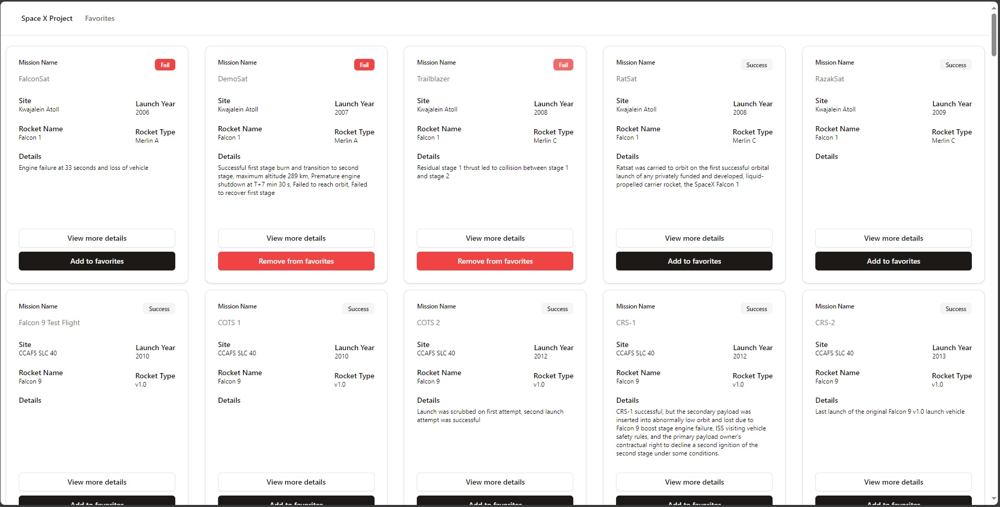

# Space X Favorites

A SpaceX launch tracking system similar to what space enthusiasts use for tracking their favorite missions.

The user has the ability to browse launches, view detailed information about each launch, and add or remove launches from their favorites list.

This project started as an assessment project for a Full Stack Developer position.




## How It's Made:

**Tech used:** Typescript, React, PostgreSQL, GraphQL, Express, NodeJS, Tailwind, ShadcnUI

This project uses Vite + React for the frontend.

PostgreSQL was used for the database, Node and Express for the backend server, and GraphQL as its API query language.

# Install

```
npm install
cd client && npm install
```

---

# Things to add

- Create a `.env` file in config folder and add the following as `key = value`
  - PORT = 4000
  - POSTGRES_USER = `your postgres user`
  - POSTGRES_PASSWORD = `your postgres password`
  - POSTGRES_DB = `your postgres db name`
  - POSTGRES_HOST = `your postgres hostname`

---

# Run

```
cd back to root
npm run build && npm start
```


## Optimizations

This project may be further improved by adding an authentication/authorization feature so that it will be available to multiple users. Also, a slight improvement would be adding a pagination to the Grid component

## Lessons Learned:

In this project, I decided to take a minimalist approach by avoiding the use of an Object-Relational Mapping (ORM) tool like Prisma. Instead, I directly interfaced with the PostgreSQL database. This decision was driven by a desire to gain a deeper understanding of database interactions without the abstraction layer that an ORM provides. Additionally, I utilized Express-GraphQL for handling GraphQL queries, further emphasizing the project's lean, focused architecture. This barebones approach provided valuable insights into the fundamental workings of databases and GraphQL, which will be beneficial for future projects.